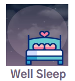
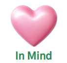
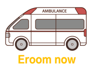

    

 

 
    <h2 style="border-bottom: 1px solid #d8dee4; color: #282d33;"> 👋 Welcome! </h2>  
        
    
 
      안녕하세요. 사용자를 생각하는 프론트엔드 개발자 이용성입니다.
    
 

     
    

 
    <h2 style="border-bottom: 1px solid #d8dee4; color: #282d33;"> 🎓Educations & Experiences </h2>  
        
 
             2024.01 ~ 2024.12 <b>삼성 청년 SW아카데미(SSAFY) 11기 이수</b>    
             2017.03 ~ 2021.08 <b>우송대학교 컴퓨터정보보안전공</b>
        

    

 
    <h2 style="border-bottom: 1px solid #d8dee4; color: #282d33;"> 👨‍💻 Project </h2>  
     
    <table align="center" style="table-layout: fixed; width: 100%; border-collapse: collapse;">
        <tr>
            <td align="center"></td>
            <td align="center"></td>
            <td align="center"></td>
            <td align="center"></td>
        </tr>
        <tr>
           <td align="center"><b><a href="https://github.com/ukal5006/WellSleep">Well Sleep</a></b></td>
                <td align="center"><b><a href="https://github.com/ukal5006/PillSoGood">Pill So Good</a></b></td>
                <td align="center"><b><a href="https://github.com/ukal5006/In-Mind">In Mind</a></b></td>
                <td align="center"><b><a href="https://github.com/ukal5006/EroomNow2">Eroom Now</a></b></td>
        </tr>
        <tr>
            <td align="center">2024.10 ~ 2024.11</td>
            <td align="center">2024.08 ~ 2024.10</td>
            <td align="center">2024.07 ~ 2024.08</td>
            <td align="center">2022.10 ~ 2022.12</td>
        </tr>
        <tr>
            <td align="center"><b>프론트엔드 리더</b></td>
            <td align="center"><b>프론트엔드 리더</b></td>
            <td align="center"><b>프론트엔드 리더</b></td>
            <td align="center"><b>개인 프로젝트</b></td>
        </tr>
        <tr>
            <td align="center">수면 측정 및 분석을 통한   수면 솔루션 서비스</td>
            <td align="center">약물 부작용 및 알림을 통한  약물 관리 서비스</td>
            <td align="center">간단한 그림 검사를 통한   아이 심리 분석 서비스</td>
            <td align="center">사용자 위치기반 실시간   응급실 조회 서비스</td>
        </tr>
    </table>

 
 

    <h2 style="border-bottom: 1px solid #d8dee4; color: #282d33;">💻 Skill</h2> 
    

        <h3 style="border-bottom: 1px solid #d8dee4; color: #282d33;">Language & Framework</h3> 
        
        
        
         
        
        
        
         

        
            
    

     
    <h3 style="border-bottom: 1px solid #d8dee4; color: #282d33;">SUPPORT TOOL</h3> 
    

        
        

         
        
        
        
    

 
 

  <h2 style="border-bottom: 1px solid #d8dee4; color: #282d33;"> ✉️ Contact</h2> 
    
  
 
    
  
  
    

 
   
 

   
    

 
  <h2 style="border-bottom: 1px solid #d8dee4; color: #282d33;"> 🏅 Stats </h2> 
     
  
 
      
 
    
 
    
  

   

